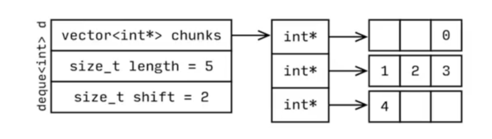

# Leetcode solutions and notes. C++

solutions to the leetcode programming problems. With theory notes.

## Sequential / Linear containers

### Array

```cpp
// c-style array on stack
int arr [] {0,1,2,3,4,5};   
double d[3];
*(arr+2) // access second element of array
*(arr+0) = *arr = arr[0] // same

// c-style array on heap
int * arr = new int[5];
delete [] arr

// c++ array
#include <array>
std::array<int, 5> arr{1, 2, 3, 4, 5};
```

### Vector

Complexity

* Searching: O(n)
* Inserting: O(n)
* Removing: O(n)
* Accessing: O(1)
* Inserting back: O(1)

Note: invalidation of pointers bacause of the re-sizing/re-allocation

```cpp
template<typename T>
class Vector{
    public:
    Vector() : buffer_{nullptr}, capacity_{2}, size_{0}
    {
        buffer_ = new T[capacity_]; // initialize a new empty array
    }
    ~Vector() 
    {
        delete[] buffer_;
    }
    
    public:
    void push_back(const T& item)
    {
        if (size_ = capacity_){
            ... ; // resize -> double the capacity
        }
        buffer_[size__++] = item;
    }
}
```

### Deque

Complexity

* Searching: O(n)
* Inserting: O(n)
* Removing: O(n)
* Accessing: O(1)
* Inserting back: O(1)
* Inserting front: O(1)

Can be implemented as a doubled linked list. C++ implementation:



To find the 3rd element of the deque:

* shift+3 = 5
* divide 5/size_of_chunks = 5/3 = 2 // second chunk
* apply 5%3 = 2 // 2nd element in the chunk

### Container adapters

Container adapters stack and queue use deque by default. They call functions of the underlaying container. E.g.:

* push() calls push_back()
* top() calls back() // only for stack
* emplace calls emplace_back()
* pop() // removes the top element

#### Stack (LIFO)

* ususally implemented as a vector or linked list
* std::stack has 2 params, one of them is a container type (default: deque)

#### Queue (FIFO)

* can be implemented as an array or linked list
* specific functions:
  * front()
  * back()

### Lined Lists

Complexity

* Searching: O(n)
* Inserting: O(n)
* Removing: O(n)
* Accessing: O(n)
* Inserting back: O(1)
* Inserting front: O(1)

### Program assignemts linked lists

[2. Add Two Numbers](https://leetcode.com/problems/add-two-numbers/) (medium) - [solution](solutions/2_add_two_numbers/)

### Strings and string_views

## Assosiative containers

### Hash Tables

#### Programming assignments hash tables

[1. Two Sum](https://leetcode.com/problems/two-sum/) (easy) - [solution](solutions/1_two_sum/)

[3. Longest Substring Without Repeating Characters](https://leetcode.com/problems/longest-substring-without-repeating-characters/) (medium) - [solution](solutions/3_longest_substring/)

### Trees

A tree is actually a type of graph, but not all graphs are trees. Simply put, a tree is a connected graph without cycles.

#### Binary Search Tree (BST)

##### Binary tree vs. binary search tree

A binary tree is a tree in which each node has up to two children. A node is called a "leaf" node if it has no children. A binary search tree is a binary tree in which every node fits a specific ordering property: all left descendents <= n < all right descendents. This must be true for each node n.

#### Binary Heaps (Min/max-Heaps)

A min-heap is a complete binary tree (that is, totally filled other than the rightmost elements on the last level) where each node is smaller than its children. The root, therefore, is the minimum element in the tree. We have two key operations on a min-heap: ```insert``` and ```extract_min```.

##### Insert

When we insert into a min-heap, we always start by inserting the element at the bottom. We insert at the rightmost spot so as to maintain the complete tree property. Then, we "fix"the tree by swapping the new element with its parent, until we find an appropriate spot for
the element. We essentially bubble up the minimum element.

This takes O( log n) time, where n is the number of nodes in the heap.

##### Extract Minimum Element

Finding the minimum element of a min-heap is easy: it's always at the top. To remove the element, we first remove the minimum element and swap it with the last element on the heap (the bottemmost, rightmost element). Then, we bubble down this element, swapping it with one of the children until the min-heap property is restored. There's no inherent ordering between the left and right element, but you'll need to take the smaller one in order to maintain the min-heap ordering.

This algorithm will take 0( log n) time.

#### Programming assignments trees

[104. Maximum Depth of Binary Tree](https://leetcode.com/problems/maximum-depth-of-binary-tree/) (easy)  - [solution](solutions/104_maximum-depth-of-binary-tree)

[226. Invert Binary Tree](https://leetcode.com/problems/invert-binary-tree/) (easy)  - [solution](solutions/226_invert_binary_tree)

#### Graphs

A graph is simply a collection of nodes with edges between (some of) them.

Graphs can be either directed or undirected. While directed edges are like a one-way street, undirected edges are like a two-way street.

* The graph might consist of multiple isolated subgraphs. If there is a path between every pair of vertices, it is called a "connected graph:'
* The graph can also have cycles (or not). An "acyclic graph" is one without cycles.

In terms of programming, there are two common ways to represent a graph.

##### Adjacency List

This is the most common way to represent a graph. Every vertex (or node) stores a list of adjacent vertices. In an undirected graph, an edge like (a, b) would be stored twice: once in a's adjacent vertices and once in b's adjacent vertices.

A simple class definition for a graph node could look essentially the same as a tree node.

```cpp
class Graph {
    public Node[] nodes;
}

class Node {
    public string Name;
    public Node[] children;
}
```

You don't necessarily need any additional classes to represent a graph. An array (or a hash table) of lists (arrays, arraylists, linked lists, etc.) can store the adjacency list. This is a bit more compact, but it isn't quite as clean. We tend to use node classes unless there's a compelling reason not to.

An adjacency list is a collection of linked lists or vectors that represent the connections between vertices in a graph. Each linked list or vector corresponds to a vertex in the graph, and contains a list of the other vertices that are connected to it.

##### Adjacency Matrices

An adjacency matrix is an NxN boolean matrix (where N is the number of nodes), where a true value at matrix[ i] [j] indicates an edge from node i to node j. In an undirected graph, an adjacency matrix will be symmetric. In a directed graph, it will not (necessarily) be.

An adjacency matrix is a two-dimensional matrix that represents the connections between vertices in a graph. Each row and column in the matrix corresponds to a vertex in the graph, and the value in the matrix represents the weight or distance between the two vertices.

The same graph algorithms that are used on adjacency lists (breadth-first search, etc.) can be performed with adjacency matrices, but they may be somewhat less efficient. In the adjacency list representation, you can easily iterate through the neighbors of a node. In the adjacency matrix representation, you will need to iterate through all the nodes to identify a node's neighbors

#### Graph Search

The two most common ways to search a graph are depth-first search and breadth-first search.

In depth-first search (DFS), we start at the root (or another arbitrarily selected node) and explore each branch completely before moving on to the next branch. That is, we go deep first (hence the name depth first search) before we go wide.

In breadth-first search (BFS), we start at the root (or another arbitrarily selected node) and explore each neighbor before going on to any of their children. That is, we go wide (hence breadth-first search) before we go deep.

Breadth-first search and depth-first search tend to be used in different scenarios. DFS is often preferred if we want to visit every node in the graph. Both will work just fine, but depth-first search is a bit simpler.

#### Tree Traversal algorithms

* Breadth-First Traversal (BFS)
* Depth-First Traversal
* Threaded Trees - Stackless Depth-First Traversal

##### Breadth-First Traversal

Implementation of this kind of traversal is straightforward when a queue is used. Consider a top-down, left-to-right, breadth-first traversal. After a node is visited, its children, if any, are placed at the end of the queue, and the node at the beginning of the queue is visited. Considering that for a node on level n, its children are on level n + 1, by placing these children at the end of the queue, they are visited after all nodes from level n are visited. Thus, the restriction that all nodes on level n must be visited before visiting any nodes on level n + 1 is met.

The main tripping point is the (false) assumption that BFS is recursive. It's not. Instead, it uses a queue.

In BFS, node a visits each of a's neighbors before visiting any of their neighbors. You can think of this as searching level by level out from a. An iterative solution involving a queue usually works best.

```cpp
void search(Node root) {
    Queue queue = new Queue();
    root.marked= true;
    queue.enqueue(root); // Add to the end of queue
    while (!queue.isEmpty()) {
        Node r= queue.dequeue(); // Remove from the front of the queue
        visit(r);
        foreach (Node n in r.adjacent) {
            if (n.marked== false) {
                n.marked= true;
                queue.enqueue(n);
            }
        }
    }
}
 ```

##### Depth-First Traversal

There are three tasks of interest in this type of traversal:

V—visiting a node
L—traversing the left subtree
R—traversing the right subtree

The three tasks can themselves be ordered in 3! = 6 ways, so there are six possible ordered depth-first traversals:
VLR VRL
LVR RVL
LRV RLV

it can be reduced to three traversals where the move is always from left to right and attention is focused on the first column. The three traversals are given these standard names:
VLR—preorder tree traversal
LVR—inorder tree traversal
LRV—postorder tree traversal

Short and elegant functions can be implemented directly from the symbolic descriptions of these three traversal. These functions may seem too simplistic, but their real power lies in recursion, in fact, double recursion. The real job is done by the system on the run-time stack. This simplifies coding but lays a heavy burden upon the system.

Note that pre-order and other forms of tree traversal are a form of DFS. The key difference is that when implementing this algorithm for a graph, we must check if the node has been visited. If we don't, we risk getting stuck in an infinite loop.

```cpp
void search(Node root) {
    if (root== null) return;
    visit(root);
    root.visited= true;
    for each (Node n in root.adjacent) {
        if (n.visited == false) {
            search(n); 
        }
    }
 }
 ```

##### In-Order Traversal

In-order traversal means to "visit" (often, print) the left branch, then the current node, and finally, the right branch. When performed on a binary search tree, it visits the nodes in ascending order (hence the name "in-order").

```cpp
inOrderTraversal(node.left);
visit(node);
inOrderTraversal(node.right);
```

##### Pre-Order Traversal

Pre-order traversal visits the current node before its child nodes (hence the name "pre-order"). In a pre-order traversal, the root is always the first node visited.

```cpp
visit(node);
preOrderTraversal(node.left);
preOrderTraversal(node.right);
```

##### Post-Order Traversal

Post-order traversal visits the current node after its child nodes (hence the name "post-order"). In a post-order traversal, the root is always the last node visited.

```cpp
postOrderTraversal(node.left);
postOrderTraversal(node.right);
visit(node);
```

#### Topological Sort

Topological Sort is used in many real world applications. For example:

* Course scheduling, ex. determining prerequisites taken in a certina order
* Make files, ex. determining the order of compilation tasks
* Instruction dependency in compiler
* Deadlock detection in operating system
* Data serialization

Topological Sort:

* A topological sort takes a Directed Acyclic Graph (DAG) and sorts the nodes in linear order.
* A DAG can have different topological ordering depending on which child node is selected.

Overview

1. Identify number of incoming edges (indegrees) for each node.
2. Add nodes with indegree=0 to a queue.
3. This part is the core of the topo sort. As long as there are nodes in the queue, keep looping.
   1. Dequeue a node from the queue, and add it to the topo ordered list.
   2. Decrement the indegree of this node's neighbors. If a neighbor's indegree becomes 0, append it to the queue.
4. The loop ends after we run out of nodes with indegree=0.
5. Finally, we check if the input graph is able to be sorted by checking if the length of the sorted list is the same as the number of input nodes.
   1. If yes, return the sorted list.
   2. If no, there is a cycle in the input graph.

Time Complexity

Total Time Complexity: O(E + V). Note: E: Edge, V: Node

#### Programming assignments Graphs

##### Graph / BFS / Topological Sort

[207. Course Schedule](https://leetcode.com/problems/course-schedule/) (medium)  - [solution](solutions/207_course_schedule)

## Design patterns

### Classes

### Singleton

## Algorithms

### Recursion and Dynamic Programming

Recursive solutions, by definition, are built off of solutions to subproblems. Many times, this will mean simply to compute f ( n) by adding something, removing something, or otherwise changing the solution for f ( n-1). In other cases, you might solve the problem for the first half of the data set, then the second half, and then merge those results.

Three of the most common approaches to develop an algorithm are bottom-up, top-down, and half-and-half.

#### Bottom-Up Approach

The bottom-up approach is often the most intuitive. We start with knowing how to solve the problem for a simple case, like a list with only one element. Then we figure out how to solve the problem for two elements, then for three elements, and so on. The key here is to think about how you can build the solution for one case off of the previous case (or multiple previous cases).

#### Top-Down Approach

In these problems, we think about how we can divide the problem for case N into subproblems.

#### Half-and-Half Approach

It's often effective to divide the data set in half.
For example, binary search works with a "half-and-half" approach. When we look for an element in a sorted array, we first figure out which half of the array contains the value. Then we recurse and search for it in that half.
Merge sort is also a "half-and-half" approach. We sort each half of the array and then merge together the sorted halves.

#### Recursive vs. Iterative Solutions

Recursive algorithms can be very space inefficient. Each recursive call adds a new layer to the stack, which means that if your algorithm recurses to a depth of n, it uses at least O ( n) memory.
For this reason, it's often better to implement a recursive algorithm iteratively. All recursive algorithms can be implemented iteratively, although sometimes the code to do so is much more complex.

### Dynamic Programming & Memoization

Dynamic programming is mostly just a matter of taking a recursive algorithm and finding the overlapping subproblems (that is, the repeated calls). You then cache those results for future recursive calls. Alternatively, you can study the pattern of the recursive calls and implement something iterative. You still
"cache" previous work.

#### Programming assignments Dynamic Programming/BFS

[221. Maximal Square](https://leetcode.com/problems/maximal-square/description/) (medium)  - [solution](solutions/221_maximal_square)

### Sorting and Searching

#### Common Sorting Algorithms

##### Bubble Sort

Runtime: 0( n^2 ) average and worst case. Memory: 0( 1).

In bubble sort, we start at the beginning of the array and swap the first two elements if the first is greater than the second. Then, we go to the next pair, and so on, continuously making sweeps of the array until it is sorted. In doing so, the smaller items slowly "bubble" up to the beginning of the list.

##### Selection Sort

Runtime: 0( n^2 ) average and worst case. Memory: 0( 1) .

Selection sort is the child's algorithm: simple, but inefficient. Find the smallest element using a linear scan and move it to the front (swapping it with the front element). Then, find the second smallest and move it, again doing a linear scan. Continue doing this until all the elements are in place.

##### Merge Sort

Runtime: 0 ( n log ( n)) average and worst case. Memory: Depends.

Merge sort divides the array in half, sorts each of those halves, and then merges (Compare the left and right half, copying back the smaller element from the two halves into the original array) them back together. Each of those halves has the same sorting algorithm applied to it. At the end, we copy any remaining elements into the target array. 

The space complexity of merge sort is 0(n) due to the auxiliary space used to merge parts of the array.

##### Quick Sort

Runtime: O(n log(n)) average, O(n2 ) worst case. Memory: 0( log(n))

In quick sort we pick a random element and partition the array, such that all numbers that are less than the partitioning element come before all elements that are greater than it. The partitioning can be performed efficiently through a series of swaps. If we repeatedly partition the array (and its sub-arrays) around an element, the array will eventually become sorted.

